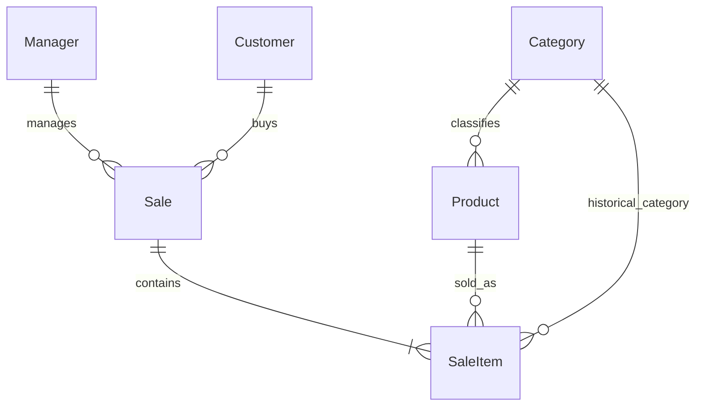

# Доменная модель

Статус: реализованы шесть POCO-сущностей в `sales-performance-api/Domain/Entities`, enum в `Domain/Enums`, DbContext и Fluent API в `Infrastructure/Persistence`. Миграция InitialCreate и seed sales-demo-v1 реализованы (см. 02-data.md); dashboard HTTP endpoints остаются следующим этапом. Актуальная Knowledge Base находится в корневой `knowledge/`; `/docs/knowledge-base/` в рабочем окружении отсутствует.

## Сущности

| Сущность | Поля и назначение |
|---|---|
| Manager | Id (Guid), Name, Initials, IsActive; продавец, не учётная запись пользователя |
| Customer | Id, Name, Company; компания пока строка, отдельная Company не нужна |
| Category | Id, Name, SortOrder; классификация продукта |
| Product | Id, CategoryId, Name, IsActive; цены каталога не используются для исторических расчётов |
| Sale | Id, SaleDate (DateTime UTC), ManagerId, CustomerId, Status, Currency; одна продажа/чек |
| SaleItem | Id, SaleId, LineNumber, ProductId, CategoryIdAtSale, ProductNameAtSale, Quantity, UnitSalePrice, UnitCost |

Связи: Manager 1:N Sale; Customer 1:N Sale; Sale 1:N SaleItem; Product 1:N SaleItem; Category 1:N Product и 1:N SaleItem через историческую категорию. Категория позиции сохраняется при продаже, чтобы смена категории продукта не переписывала прошлую аналитику. Имена менеджера/клиента и название категории берутся текущие; аудит переименований вне MVP.

## Enums и значения API

- SaleStatus: `Paid`, `Cancelled`, `Refunded` — точное написание frontend, JSON strings.
- PeriodKey: `today`, `last7`, `last30`, `thisMonth`, `lastMonth`, `custom` — параметры запроса, не справочник БД.
- RankingMode: `grossProfit`, `avgCheck`.
- TimeSeriesMetric: `revenue`, `grossProfit`, `salesCount`; API отдаёт все три значения за день.

`Deal.stage` (Closed Won и другие) из неиспользуемой CRM-модели не является SaleStatus.

## Инварианты

- Продажа имеет одного менеджера, одного клиента и минимум одну позицию. Запись всего агрегата атомарная.
- Quantity — положительное целое; UnitSalePrice и UnitCost — неотрицательные decimal с двумя знаками. Бесплатные и убыточные продажи допустимы.
- Валюта одна, USD, согласно текущему форматированию UI. Конвертации валют нет.
- SaleCount — число уникальных Paid Sale.Id, не число строк и не сумма Quantity.
- UnitSalePrice/UnitCost — снимок фактических цен на момент сделки. Revenue и Profit не хранятся как независимо редактируемые поля.
- Refunded означает полный возврат всего чека; частичные возвраты и отдельный журнал возвратных проводок вне модели.
- Paid участвует в метриках; Cancelled и Refunded исключены и из выручки, и из себестоимости, и из знаменателя Average Check.
- Статус текущий: возврат исключает продажу из её исходного периода. Это аналитика текущего состояния, не бухгалтерский отчёт движения денег по дате возврата.
- Переходы статуса не нужны read API. Для будущего write API предполагается Paid → Refunded; точные переходы Cancelled и первоначального статуса потребуют отдельного решения.
- Исторические справочники нельзя физически удалять, если на них ссылаются продажи; IsActive скрывает их только из будущего ввода, не из отчётов.
- Все Id API — непрозрачные строки UUID; mock Id `sc`, `p1`, `s1` не становятся доменными ключами.

Допущение: Enterprise/Mid-Market/SMB/Startup трактуются как категории продуктов, хотя старый `category-breakdown` называет их customer tiers. Подтвердить предметный смысл до импорта реальных данных.

## Детали реализации

- `SaleDate` заменяет проектное имя `SoldAt` согласно текущему заданию; колонка `sales.sale_date`. Это момент продажи, а не DateOnly. PostgreSQL `timestamp with time zone` хранит UTC instant; timezone отчёта в самой колонке не хранится. Npgsql отклоняет Local/Unspecified DateTime при записи в timestamptz ([документация](https://www.npgsql.org/doc/types/datetime.html)).
- Все Id создаются через Guid.NewGuid() в сущностях; EF использует ValueGeneratedNever. Нет зависимости от PostgreSQL extensions для UUID.
- Навигации обязательных родителей представлены non-nullable ссылками, заполняются через загрузку EF/relationship fixup; коллекции инициализированы и доступны для заполнения графа. Lazy loading не включён.
- `Manager.IsActive` и `Product.IsActive` по умолчанию true; `Sale.Currency` — USD, `Category.SortOrder` — 0. Status требуется явно при создании Sale; enum Paid=0, Cancelled=1, Refunded=2, в БД сохраняются имена.
- Положительность quantity/lineNumber, неотрицательные цены, допустимые статус/валюта, конечность SaleDate, непустые после btrim названия/инициалы/компания защищены CHECK. Строки обязательны и имеют ограничения длины.
- Сущности остаются POCO для слоя хранения: `required` проверяет инициализацию в C#, а NOT NULL/CHECK/FK защищают БД. Снимки являются отдельными хранимыми полями; произвольный setter не запрещён. Будущий write service должен атомарно создавать чек с минимум одной позицией, проверять точность входных цен (PostgreSQL округляет лишние знаки), не менять исторические поля и контролировать переходы статуса. Эти межстрочные/жизненные инварианты ещё не реализованы.
- Нет global query filter по статусу или IsActive: отмены/возвраты нужны Recent Sales, неактивные менеджеры — истории. Paid-фильтр должен быть явным в аналитических запросах.
